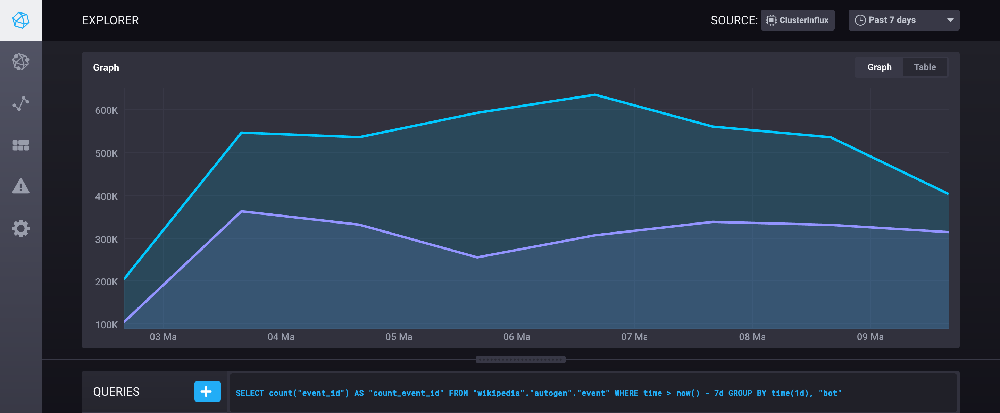

# Packaged Kubernetes deployments - Writing a Helm Chart

Throughout my time at Influx, and even before, I have been working with containers, and occasionally doing useful things with them! This lead me to try out Kubernetes, which I have found to be very useful. In my job I end up having to deploy random code for things like internal dashboards, demos, reporting, and data collection. Much of this code lives on a small Kube cluster that I maintain. 

At first when I started running Kubernetes I found keeping track of all my `*.yaml` files to be a pain. I had a repository where I would keep the current state of my deployments. As you can imagine this was a management nightmare. I would end up copy pasting from old projects to get started with new ones, and keeping the repo up to date was a pain! I even wrote a quick little bash program to help with this. 

Bottom line is when you are running Kubernetes you quickly get to a place where management of your deployment files is cumbersome. This is not to mention the problem of ensuring that you are using deployment best practices. 

Enter `helm`. 

[Helm](https://github.com/kubernetes/helm) is a tempting, packaging and deployment manager for Kubernetes. Think of it like `apt-get` or `brew` for Kubernetes. It consists of a server that runs in your cluster and renders your templates, `tiller`, and a command line interface `helm`. 

This is a quick guide to writing a simple `helm` chart with a focus on workflow. If you want to follow along download [`helm`](https://github.com/kubernetes/helm/blob/master/docs/install.md). A familiarity with Kubernetes and Docker is required.

### 1. Find an application to deploy

I'll be deploying a small node app that has been sitting in my Github. [WEC](https://github.com/jackzampolin/wec/) is a small `nodejs` application that subscribes to the [Wikipedia Recent Changes](https://www.mediawiki.org/wiki/Manual:RCFeed) feed. When it receives an event, it parses and inserts the event into an InfluxDB instance. I'm using the excellent [node-influx/node-influx](https://github.com/node-influx/node-influx) Javascript client to write to the database.

You can check out the code in [`/server.js`](https://github.com/jackzampolin/wec/blob/server.js).

### 2. Dockerize It!

When creating a helm chart you first need an image to run. I've created a Dockerfile for this server. The next step is to push it to a Docker Registry that is accessible from your cluster. I use `gcr.io` because of it's ease of use in Google Cloud. Other options are [Docker Hub](https://hub.docker.com/) and [Quay.io](https://quay.io/). You could also push to a private registry. To build and push the image from this repository run:

```sh
$ cd wec
$ export ORG=myorg
$ export REGISTRY=gcr.io
$ docker build -t $REGISTRY/$ORG/wec:latest .
$ docker push $REGISTRY/$ORG/wec:latest
```

### 3. Stub out helm chart

The `helm` cli has a command to stub out your chart. This makes getting projects started quick and easy. To create the chart files for WEC just run `helm create wec`. A directory, `wec`, will be created in the current directory with the following files:

```
$ tree wec/
wec/
├── Chart.yaml
├── charts
├── templates
│   ├── NOTES.txt
│   ├── _helpers.tpl
│   ├── deployment.yaml
│   └── service.yaml
└── values.yaml

2 directories, 6 files
```
* [`Chart.yaml`](https://github.com/kubernetes/helm/blob/master/docs/charts.md#the-chartyaml-file) contains metadata about the chart. You can use the defaults. 
* `charts/` holds any dependency charts. You can delete this folder now. This is used when building a chart from component charts.
* `templates/` holds all of your template files! This is where you do your work.
* `values.yaml` holds any variables you want to reference in your templates. These are the configuration options you present to the end user.

I've moved the chart into a directory called `chart`.

### 4. Write your .yaml files

Helm starts you off with a `deployment.yaml` and a `service.yaml`. If you need other types of Kubernetes objects in your chart the [`kubernetes/charts`](https://github.com/kubernetes/charts/) repo has some great examples:

* [`ingress`](https://github.com/kubernetes/charts/blob/master/stable/chronograf/templates/ingress.yaml)
* [`pvc`](https://github.com/kubernetes/charts/blob/master/stable/influxdb/templates/pvc.yaml)
* [`configmap`](https://github.com/kubernetes/charts/blob/master/stable/influxdb/templates/config.yaml)
* [`service`](https://github.com/kubernetes/charts/blob/master/stable/nginx-ingress/templates/controller-service.yaml)
* [`daemonset`](https://github.com/kubernetes/charts/blob/master/stable/nginx-ingress/templates/controller-daemonset.yaml)

Helm uses [Golang templates](https://golang.org/pkg/text/template/) as a tempting language. It will expand any variables in `{{}}`. As a chart author, you have some [built-in objects](https://github.com/kubernetes/helm/blob/master/docs/chart_template_guide/builtin_objects.md) available for reference in your chart files (e.g. `{{ .Release.Namespace }}`) as well as the [`values.yaml`](https://github.com/kubernetes/helm/blob/master/docs/chart_template_guide/values_files.md) file (e.g. `{{ .Values.database_name }}`). There are two sets of template helper functions as well: [Sprig](https://github.com/Masterminds/sprig#functions) and [Golang template](https://golang.org/pkg/text/template/) functions.

Conveniently, for `wec` we only require a `deployment`. `wec` subscribes to the Wikipedia feed and receives the data back without needing to expose an endpoint! Very easy! We will need to set a couple of `ENV` as well to point to the database, other than that the stock file looks the same. We want to make those database connection parameters available in the `values.yaml` file to make database configuration easy. Here is our deployment file:

```yaml
apiVersion: extensions/v1beta1
kind: Deployment
metadata:
  # Template helpers are stored in /templates/_helpers.yaml
  name: {{ template "fullname" . }}
  labels:
    chart: "{{ .Chart.Name }}-{{ .Chart.Version }}"
spec:
  replicas: {{ .Values.replicaCount }}
  template:
    metadata:
      labels:
        app: {{ template "fullname" . }}
    spec:
      containers:
      - name: {{ .Chart.Name }}
        image: "{{ .Values.image.repository }}:{{ .Values.image.tag }}"
        imagePullPolicy: {{ .Values.image.pullPolicy }}
        env: 
        - name: DATABSE_NAME
          # `quote`-ing strings prevents type errors on yaml parsing
          value: {{ .Values.database_name | quote }}
        - name: INFLUX_URL
          value: {{ .Values.influx_url | quote }}
        - name: INFLUX_PORT
          value: {{ .Values.influx_port | quote }}
        - name: BATCH_SIZE
          value: {{ .Values.batch_size | quote }}
        - name: CONNECTION_URL
          value: {{ .Values.connection_url | quote }}
```

And the default `values.yaml`:
  
```yaml
replicaCount: 1
image:
  repository: gcr.io/influx-perf-testing/wec
  tag: latest
  pullPolicy: Always
database_name: 'wikipedia'
influx_url: "db-influxdb.prod"
influx_port: "8086"
batch_size: 10
connection_url: 'https://stream.wikimedia.org/rc'
```

### 5. Test your chart

Now that we have written a chart we need to see if it produces the proper result. Luckily `helm` has some utilities to help with this. To see the deployment files that will be output by helm run the following command:

```bash
$ helm install --dry-run --debug --name test --namespace test chart/wec/
```

This debug output is very helpful in chart development and is a great way to inspect the output of your chart and check for any errors before trying to install it on your cluster.

> _Tip_: If you run helm install without `--dry-run --debug` and your chart errors out sometimes there is a ghost release left. You can delete image by passing the `--purge` option to `helm delete {{ .Release.Name }}`.

### 6. Deploy it!

When you are ready to deploy your chart just run `helm install --name wec --namespace wec ./chart/wec/` to install!

When you run the install you should see the output of [`NOTES.txt`](https://github.com/kubernetes/helm/blob/master/docs/chart_template_guide/notes_files.md). This should give instructions on how to health check, or interact with the deployment:
  
```bash
$ helm install --name wec --namespace wec ./chart/wec/
NAME:   foo
LAST DEPLOYED: Fri Mar 10 09:04:37 2017
NAMESPACE: bar
STATUS: DEPLOYED

RESOURCES:
==> extensions/v1beta1/Deployment
NAME     DESIRED  CURRENT  UP-TO-DATE  AVAILABLE  AGE
foo-wec  1        1        1           0          0s


NOTES:
Watch for you pods to come up by running the following command:

- kubectl get pods --namespace bar -l app=foo-wec -w

Check the logs on a running pod with the following:

- kubectl logs $(kubectl get pods --namespace bar -l app=foo-wec -o jsonpath='{ .items[0].metadata.name }')
```

Once the deployment is running you should be able to see the events flowing into your InfluxDB instance. Then you can have fun exploring the data! Here is a graph of the number of bot vs human edits on wikipedia (the humans are winning - for now):
  


### 7. Next Steps

This guide just scratches the surface of helm charts. Helm also offers [`hooks`](https://github.com/kubernetes/helm/blob/master/docs/charts_hooks.md) to enable running jobs at different points in chart lifecycle. There is also an excellent [tips and tricks](https://github.com/kubernetes/helm/blob/master/docs/charts_tips_and_tricks.md) guide for debugging common issues. And [packaging charts for distribution](https://github.com/kubernetes/helm/blob/master/docs/chart_repository.md) and building chart repos could be another blog post in and of itself. If you have further questions, the helm community is active on the [Kubernetes](http://slack.k8s.io/) slack in the `helm` channel. 

If you are interested in experimenting more with the InfluxData stack we have charts for all of our products available in the main charts repo:
  
* [`kapacitor`](https://github.com/kubernetes/charts/blob/master/stable/kapacitor)
* [`influxdb`](https://github.com/kubernetes/charts/blob/master/stable/influxdb)
* [`chronograf`](https://github.com/kubernetes/charts/blob/master/stable/chronograf)
* [`telegraf`](https://github.com/kubernetes/charts/blob/master/stable/telegraf)

